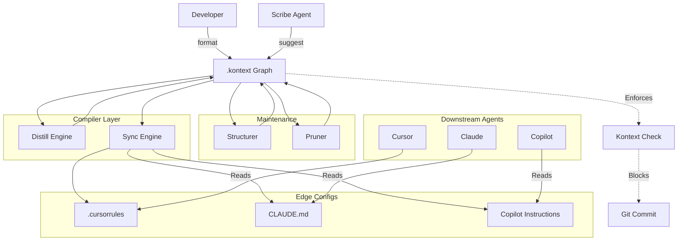

# Architecture: The Upstream Authority

Kontext uses an **"Upstream Authority"** architecture. It acts as the central brain that "compiles" State (Truth) into formats that Edge Agents (Cursor, Claude, Copilot) can understand.

## 1. The Core Data Structure: The Knowledge Graph
Location: `.kontext/`
*   **Nodes:**
    *   **Decision (ADR):** An immutable record of a choice (`ADR-001`).
    *   **Topic:** A logical grouping (`Architecture`, `Frontend`, `Security`).
    *   **Constraint:** A specific, enforceable rule derived from a Decision (`"No axios"`).
*   **Edges:**
    *   `Supersedes` (Time-based evolution).
    *   `RelatesTo` (Dependency).

## 2. The Functional Layers (The Agentic Lifecycle)

### Stage 1: The Scribe (Input)
*   **Command:** `kontext suggest`
*   **Behavior:** Active Observation. Watches `git diff`, infers intent, and drafts new ADRs.

### Stage 2: The Structurer (Standardization)
*   **Command:** `kontext format`
*   **Behavior:** Input Sanitization. Converts raw notes into canonical ADRs (markdown + frontmatter).

### Stage 3: The Pruner (Optimization)
*   **Command:** `kontext distill`
*   **Behavior:** Context Compression.
    *   **Strategy:** "Tombstoning". Merges duplicates but keeps the old file as a lightweight pointer (Superseded) to preserve history without token bloat.

### Stage 4: The Broadcaster (Distribution)
*   **Command:** `kontext sync`
*   **Behavior:** Context Compilation.
    *   **Logic:** Compiles active ADRs into a single Markdown block.
    *   **Target:** Injects into `.cursorrules` and `CLAUDE.md`.

### Stage 5: The Guard (Enforcement)
*   **Command:** `kontext check`
*   **Behavior:** Semantic Linting.
    *   **Hook:** Runs on `pre-commit`.
    *   **Logic:** Audits code against the Graph. Violations = Blocked Commit.

## 3. The Wiring Diagram

## 4. Key Technical Decisions
*   **Local First:** The Graph lives in the repo (git). No external SaaS required for basic function.
*   **Markdown Native:** The Source of Truth is human-readable Markdown.
*   **Vector-Lite:** We use lightweight TF-IDF / Embeddings for "Match & Inject" locally, avoiding heavy Vector DB infrastructure until absolutely necessary (Phase 3+).