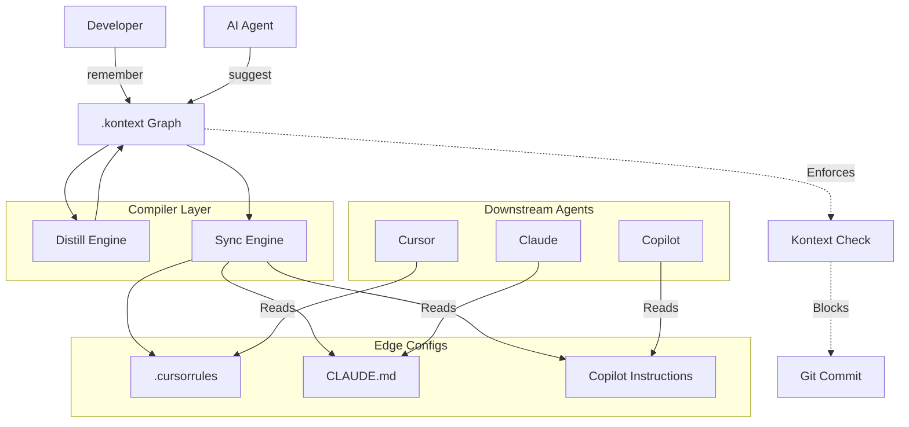

# Architecture: The Upstream Authority

Kontext uses an **"Upstream Authority"** architecture. It acts as the central brain that "compiles" State (Truth) into formats that Edge Agents (Cursor, Claude, Copilot) can understand.

## 1. The Core Data Structure: The Knowledge Graph
Location: `.kontext/`
*   **Nodes:**
    *   **Decision (ADR):** An immutable record of a choice (`ADR-001`).
    *   **Topic:** A logical grouping (`Architecture`, `Frontend`, `Security`).
    *   **Constraint:** A specific, enforceable rule derived from a Decision (`"No axios"`).
*   **Edges:**
    *   `Supersedes` (Time-based evolution).
    *   `RelatesTo` (Dependency).

## 2. The Functional Layers

### Layer 1: The "Write" Path (Input)
How truth enters the system.
*   **`kontext remember`:** Manual entry (Human intent).
*   **`kontext suggest`:** AI entry (Inferred intent from Code).
    *   *Input:* `git diff`
    *   *Process:* LLM analyzes changes -> Matches against History -> Proposes new ADR.

### Layer 2: The "Compiler" Path (Processing)
How truth is optimized.
*   **`kontext distill`:** The Garbage Collector.
    *   *Process:* Scans all ADRs -> Identifies duplicates/obsolete -> Merges them into a "Canonical View".
*   **`kontext sync`:** The Transpiler.
    *   *Input:* The Knowledge Graph.
    *   *Output:* Vendor-specific configs (`.cursorrules`, `CLAUDE.md`, `.windsurfrules`).
    *   *Logic:* Projects the graph into a flat set of instructions, filtered by "Focus" (Context Pruning).

### Layer 3: The "Read" Path (Output/Enforcement)
How agents consume truth.
*   **Passive (File-based):** Agents read the files generated by `sync`.
*   **Active (MCP):** Agents query `kontext serve` (Future).
*   **Enforced (Hooks):** `kontext check` validates `git staged` against the Graph constraints.

## 3. The Wiring Diagram

## 4. Key Technical Decisions
*   **Local First:** The Graph lives in the repo (git). No external SaaS required for basic function.
*   **Markdown Native:** The Source of Truth is human-readable Markdown.
*   **Vector-Lite:** We use lightweight TF-IDF / Embeddings for "Match & Inject" locally, avoiding heavy Vector DB infrastructure until absolutely necessary (Phase 3+).